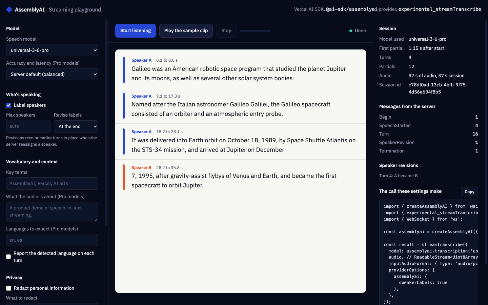

# AssemblyAI streaming playground

A browser playground for AssemblyAI real-time transcription through the Vercel AI SDK:
`experimental_streamTranscribe` with the `@ai-sdk/assemblyai` provider.

Speak into the microphone (or play the bundled sample clip) and watch partial words settle
into final turns, with speaker labels, live speaker revisions, PII redaction, and the other
streaming options exposed as controls. The right-hand panel shows the exact `streamTranscribe`
call your settings produce.



## How it works

The browser cannot hold the AssemblyAI API key or send the `Authorization` WebSocket header,
so the page relays audio to a small Node server (`server.ts`). The server runs the real
provider via `experimental_streamTranscribe` and forwards every stream part back to the page.

The browser-to-relay protocol is the AI SDK's transcription-stream envelope, the same wire
format AI Gateway speaks: one `transcription-stream.start` text frame, binary 16 kHz PCM
frames, a `transcription-stream.audio-done` frame, and JSON-serialized
`TranscriptionModelV4StreamPart`s back.

## Run it

From the repository root, after `pnpm install` and `pnpm build`:

```bash
cd examples/assemblyai-streaming-playground
pnpm dev
```

Then open http://localhost:3210. The server reads `ASSEMBLYAI_API_KEY` from
`examples/assemblyai-streaming-playground/.env` or, failing that, from
`examples/ai-functions/.env`.
